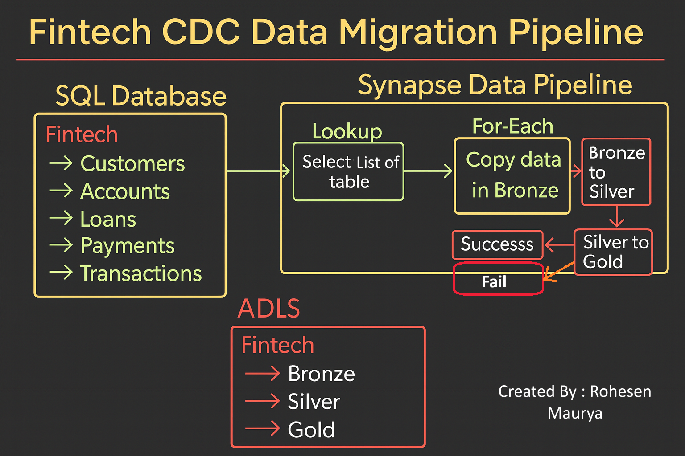

# Fintech Data Migration — Azure Synapse (Bronze → Silver → Gold)

**Overview:** End-to-end Azure data pipeline that migrates historical fintech data from an Azure SQL Database (`rohesensqldb`) into ADLS Gen2 and models it as Delta Lake (Bronze → Silver → Gold) using Synapse Copy Activities, PySpark notebooks, and Synapse orchestration. Production-style, idempotent, and notification-enabled.

---

[](#) [](#)

> Demo screenshots are included in the `Project Screenshots/` folder.

---

## Table of contents

1. [Architecture (visual)](#architecture-visual)
2. [Tech stack](#tech-stack)
3. [What’s in this repo](#whats-in-this-repo)
4. [Quick demo (recommended for recruiters)](#quick-demo-recommended-for-recruiters)
5. [Setup & run (step-by-step)](#setup--run-step-by-step)
6. [Key implementation details & snippets](#key-implementation-details--snippets)
7. [Files / folder layout](#files--folder-layout)
8. [Operational considerations & best practices](#operational-considerations--best-practices)
9. [Resume bullets / How to present this project](#resume-bullets--how-to-present-this-project)
10. [Next steps & enhancements](#next-steps--enhancements)
11. [License & Contact](#license--contact)

---

## Architecture (visual)



**Flow:** Azure SQL (`rohesqldb` / schema `fintech`) → Synapse Copy (Lookup → ForEach Copy) → ADLS Gen2 `/fintech/bronze` (parquet) → Synapse Spark Notebook `BronzeToSilverDataProcess` → ADLS `/fintech/silver` (Delta) → Synapse Notebook `SilverToGoldDataProcess` → ADLS `/fintech/gold` (Delta dims & facts). Orchestration uses `FintechDataPipeline` with Logic App Web Activities for success/fail notifications.

Screenshots from runs (see `/Project Screenshots/`):

* `rohesqldb.png` (source DB)
* `bronze layer after pipeline run.png`
* `silver layer after pipeline run.png`
* `gold layer after pipeline run.png`
* `Successful_Run_FintechDataPipeline.png`
* `Email_Notification_after_pipeline_run.png`

---

## Tech stack

* Azure Synapse Analytics (Pipelines + Spark pool / Notebook)
* Azure SQL Database (`rohesensqldb`) — source schema `fintech`
* Azure Data Lake Storage Gen2 (ADLS) — container `fintech` (folders: `bronze/`, `silver/`, `gold/`)
* PySpark (notebooks) + Delta Lake
* Logic Apps (email notifications via Web activity)
* T-SQL for DDL + metadata query

---

## What’s in this repo

* `Project Screenshots/` — demo screenshots you can use in the README
* `spark_notebooks/` — notebook files (Bronze → Silver, Silver → Gold)
* `sql_database_tables/` — DDL for `fintech` schema
* `sql_query_for_get_metadata_activity.sql` — the Lookup query used in the pipeline
* `README.md` — this file

---

## Quick demo (recommended for recruiters)

1. Open `Project Screenshots/FintechDataPipeline.png` — architecture.
2. Show `rohesqldb.png` (SQL schema & tables).
3. Run the Synapse pipeline in the workspace (demo can run for a single table `Customers` to speed things up).
4. Inspect ADLS:

   * Bronze folder: `Project Screenshots/bronze layer after pipeline run.png`
   * Silver Delta folder preview: `Project Screenshots/silver layer after pipeline run.png`
   * Gold Delta folder preview: `Project Screenshots/gold layer after pipeline run.png`
5. Show pipeline success screenshot: `Project Screenshots/Successful_Run_FintechDataPipeline.png`
6. Show email notification screenshot: `Project Screenshots/Email_Notification_after_pipeline_run.png`

> Tip: For a 3–5 minute live demo use a small sample (Customers) so everything runs quickly.

---

## Setup & run (step-by-step)

### Prerequisites

* Azure subscription
* Synapse workspace with a Spark pool
* ADLS Gen2 storage account (container `fintech`)
* Azure SQL Database `rohesensqldb` (or local dev SQL)
* Appropriate permissions & Managed Identity or Service Principal

### 1) Provision / configure resources

* Create Resource Group, ADLS, Synapse, Azure SQL
* Grant Synapse Managed Identity access to ADLS (Storage Blob Data Contributor) and to Azure SQL as needed (or use a service principal)

### 2) Create `fintech` schema + tables

Run the following DDL (see `sql_database_tables/fintech_schema.sql` for full file):

```sql
CREATE SCHEMA fintech;

CREATE TABLE fintech.Accounts (
    AccountID INT PRIMARY KEY,
    CustomerID INT,
    AccountType NVARCHAR(50),
    Balance DECIMAL(18, 2),
    OpenDate DATE
);

CREATE TABLE fintech.Customers (
    CustomerID INT PRIMARY KEY,
    FirstName NVARCHAR(100),
    LastName NVARCHAR(100),
    Email NVARCHAR(255),
    PhoneNumber NVARCHAR(50),
    Address NVARCHAR(255),
    City NVARCHAR(100),
    State NVARCHAR(100),
    Country NVARCHAR(100),
    ZipCode NVARCHAR(20),
    SignupDate DATE
);

CREATE TABLE fintech.Loans (
    LoanID INT PRIMARY KEY,
    CustomerID INT,
    LoanType NVARCHAR(50),
    LoanAmount DECIMAL(18, 2),
    InterestRate DECIMAL(5, 2),
    LoanStartDate DATE,
    LoanEndDate DATE
);

CREATE TABLE fintech.Payments (
    PaymentID INT PRIMARY KEY,
    LoanID INT,
    PaymentDate DATE,
    PaymentAmount DECIMAL(18, 2),
    PaymentMethod NVARCHAR(50)
);

CREATE TABLE fintech.Transactions (
    TransactionID INT PRIMARY KEY,
    AccountID INT,
    TransactionDate DATE,
    Amount DECIMAL(18, 2),
    TransactionType NVARCHAR(50),
    Description NVARCHAR(255)
);
```

Load your sample/historical data (INSERTs, BCP, or bulk load).

### 3) Synapse Linked Services / Datasets

* Create Linked Service to Azure SQL (`rohesensqldb`).
* Create Linked Service to ADLS Gen2 (container: `fintech`).
* Create parameterized dataset (SQL source) with parameters `schemaname`, `tablename`.
* Create sink dataset for ADLS Bronze folder (parquet) using path pattern.

### 4) Pipeline: `FintechDataPipeline`

Key activities:

**Lookup activity** (Get table list) — SQL query:

```sql
SELECT 
    TABLE_SCHEMA AS SchemaName,
    TABLE_NAME AS TableName
FROM INFORMATION_SCHEMA.TABLES
WHERE TABLE_TYPE = 'BASE TABLE' AND TABLE_SCHEMA = 'fintech'
ORDER BY SchemaName, TableName;
```

**ForEach** — iterate over items from Lookup and run `CopyDataToBronzeLayer` (Copy Activity).

**CopyDataToBronzeLayer** — dynamic source query:

```
@{concat('Select * From ', item().SchemaName, '.', item().TableName)}
```

Sink path pattern (example):

```
fintech/bronze/@{concat(item().SchemaName,'/', item().TableName)}/@{concat(item().TableName,'.parquet')}
```

After copies finish:

* Notebook activity: `BronzeToSilverDataProcess` (PySpark)
* Notebook activity: `SilverToGoldDataProcess` (PySpark)
* Web activity: `SuccessNotification` (Logic App)
* Web activity: `FailNotification` (Logic App)

---

## Key implementation details & snippets

### Bronze → Silver notebook (`BronzeToSilverDataProcess`)

Reads Bronze parquet files and writes Delta Silver tables with simple enrichments:

```python
from pyspark.sql.functions import *

base_path = "abfss://fintech@<account>.dfs.core.windows.net/bronze/fintech/"
output_base_path = "abfss://fintech@<account>.dfs.core.windows.net/silver/fintech/"

# Accounts: calculate account age
df = spark.read.parquet(f"{base_path}Accounts/Accounts.parquet")
df_transformed = df.withColumn("AccountAgeYears", round(datediff(current_date(), col("OpenDate")) / 365.25, 2))
df_transformed.write.format("delta").mode("overwrite").save(f"{output_base_path}Accounts/")
```

Other transformations in the notebook:

* `Customers`: create `FullName` and `MaskedEmail`
* `Loans`: compute `TotalInterest`, `LoanDurationYears` (explicit casting)
* `Payments`: `DaysSinceLastPayment`
* `Transactions`: `TransactionCategory` mapping (`Deposit`→`Income`, `Withdrawal`→`Expense`)

### Silver → Gold notebook (`SilverToGoldDataProcess`)

Builds dimension and fact Delta tables for analytics:

```python
# Example: dim_customers
customers_df = spark.read.format("delta").load(f"{silver_base_path}Customers/")
dim_customers_df = customers_df.select(
    col("CustomerID").alias("customer_id"),
    col("FirstName").alias("first_name"),
    col("LastName").alias("last_name"),
    col("Email").alias("email"),
    ...
)
dim_customers_df.write.format("delta").mode("overwrite").save(f"{output_base_path}dim_customers/")
```

Facts:

* `fact_payments` joins `payments` and `loans` for payment events
* `fact_transactions` joins `transactions` and `accounts` to include `customer_id`

---

## Files / folder layout (in-repo)

```
/Project Screenshots/
  FintechDataPipeline.png
  rohesqldb.png
  bronze layer after pipeline run.png
  silver layer after pipeline run.png
  gold layer after pipeline run.png
  Successful_Run_FintechDataPipeline.png
  Email_Notification_after_pipeline_run.png

/spark_notebooks/
  BronzeToSilverDataProcess.py (or .ipynb)
  SilverToGoldDataProcess.py (or .ipynb)

/sql_database_tables/
  fintech_schema.sql

sql_query_for_get_metadata_activity.sql  # Lookup query for pipeline
README.md
```

---

## Next steps & enhancements

* Implement incremental loads using watermarks and Delta `MERGE`.
* Integrate data quality framework (Great Expectations) and automated tests.
* Add CI/CD (ARM/Bicep or Terraform) and parameterized deployments.
* Hook a Power BI report to the Gold layer to showcase KPIs (customer balances, monthly revenue).

---

## License

This project is provided under the **MIT License** — modify as you see fit. (Add a `LICENSE` file with the MIT text.)

